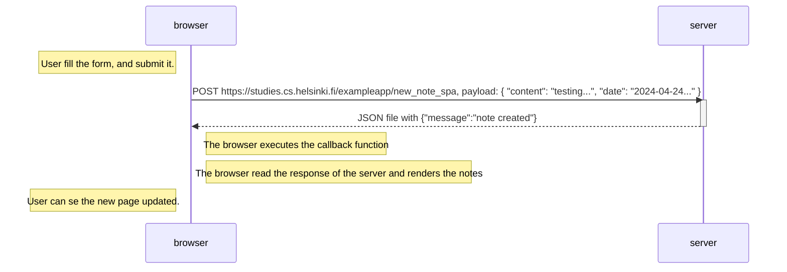

```mermaid
sequenceDiagram
    participant browser
    participant server

    Note left of browser: User fill the form, and submit it.

    browser->>server: POST https://studies.cs.helsinki.fi/exampleapp/new_note_spa, payload: { "content": "testing...", "date": "2024-04-24..." }
    activate server
    server-->>browser: JSON file with {"message":"note created"}
    deactivate server

    Note right of browser: The browser executes the callback function

    Note right of browser: The browser read the response of the server and renders the notes

    Note left of browser: User can se the new page updated.
```
